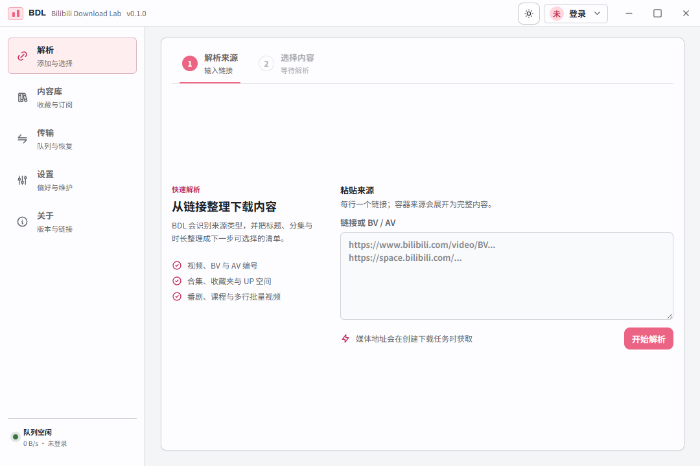
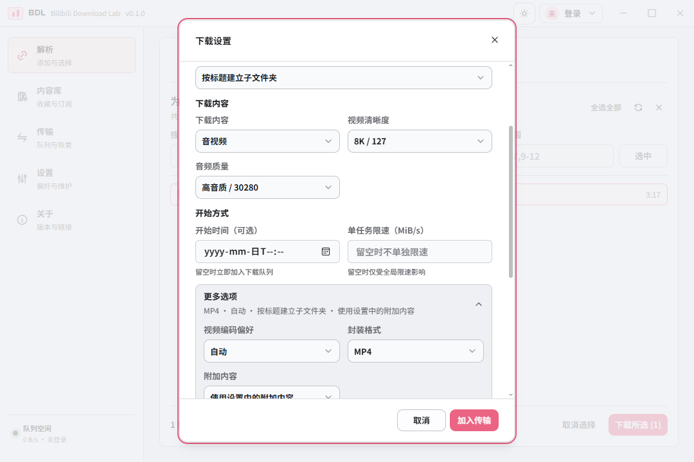
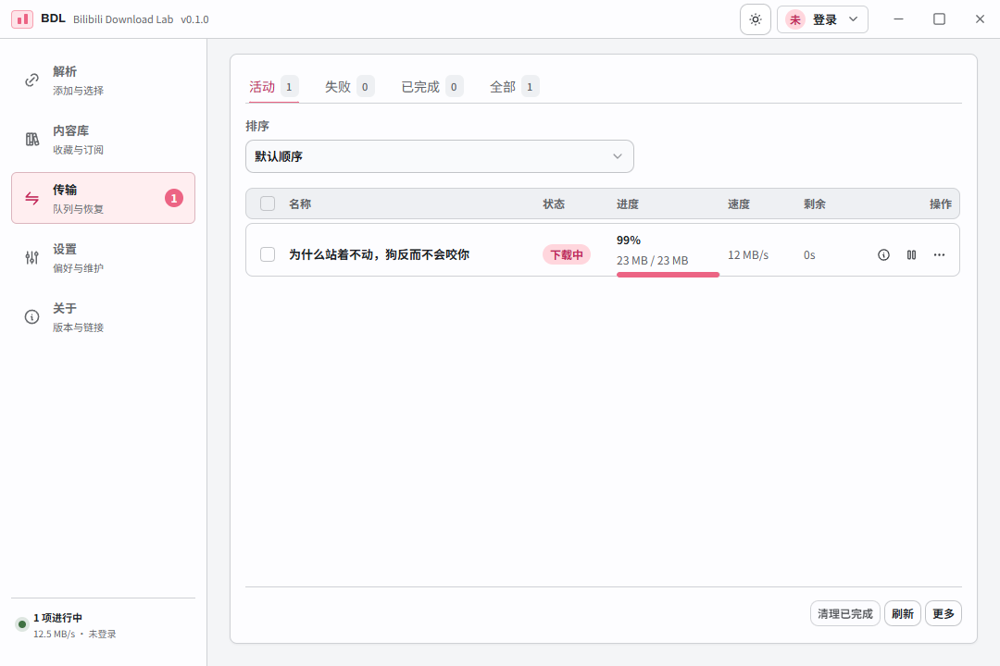
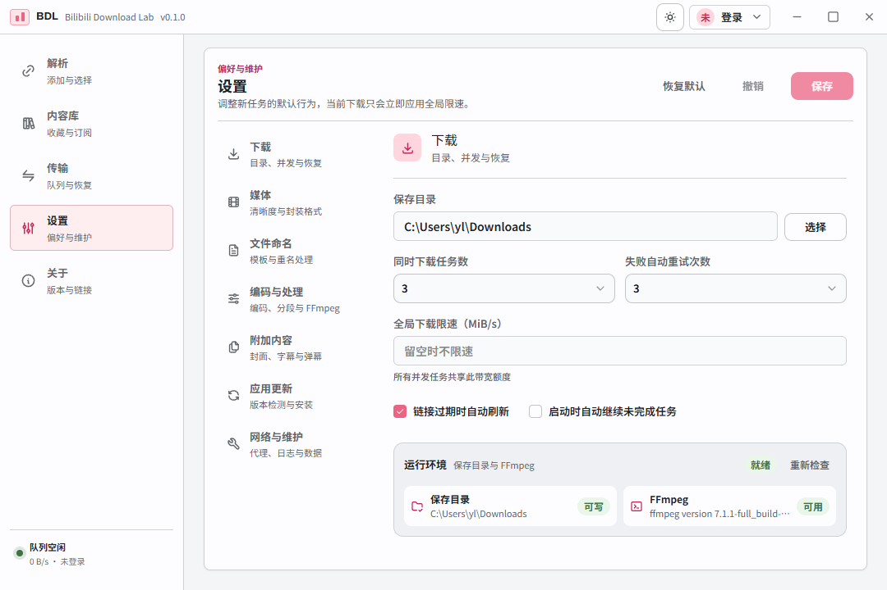
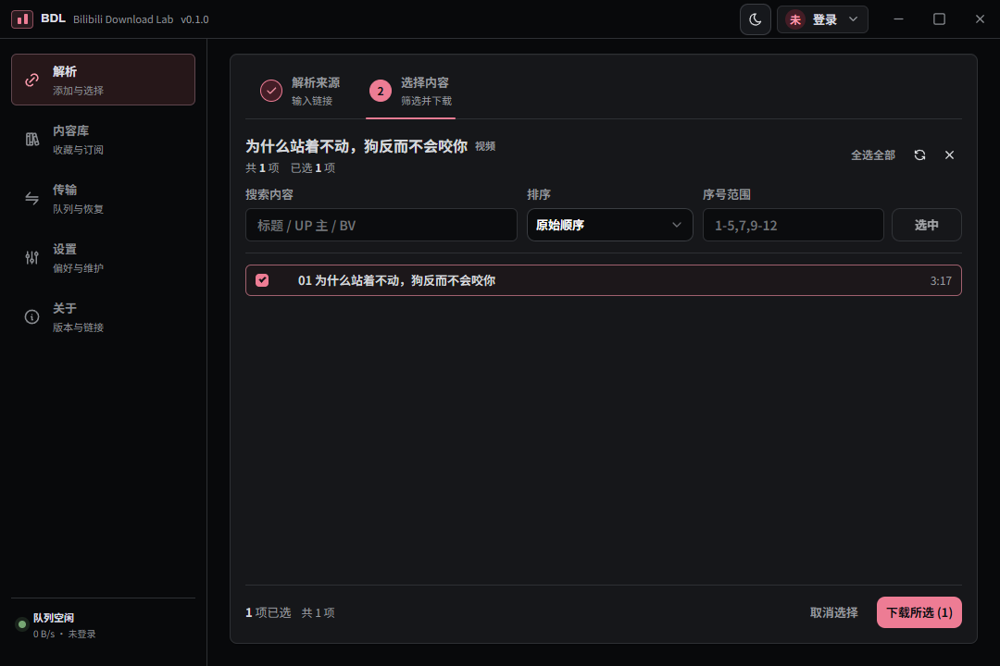

# BDL · Bilibili Download Lab

[](https://github.com/Yuelioi/bdl/actions/workflows/ci.yml)
[](https://github.com/Yuelioi/bdl/releases/latest)
[](LICENSE)
[](https://github.com/Yuelioi/bpi-rs)

一个专注、可靠、本地优先的哔哩哔哩下载工具。BDL 基于 [bpi-rs](https://github.com/Yuelioi/bpi-rs) 实现 Bilibili API 能力，并使用 Rust、Tauri 与 Vue 构建，把来源解析、批量选择、下载队列、失败恢复和媒体后处理整合在统一的工作区中。

> 当前版本：`0.6.1` · Windows/macOS 正式支持 · Linux 预览 · Android ARM64 开发预览



## 功能特性

- **丰富的来源支持**：普通视频、多 P 视频、UP 主投稿、收藏夹、订阅合集、番剧与课程。
- **按需解析**：列表阶段只加载标题、封面、分 P 等必要信息，创建任务时再获取媒体地址与编码信息。
- **批量工作流**：支持搜索、排序、范围选择、分页加载、继续加载和批量创建下载任务。
- **可靠的下载队列**：断点续传、并发分段、备用 CDN、暂停/继续、链接刷新、重试与启动恢复。
- **媒体后处理**：通过 FFmpeg 合并视频与音频，可选 MP4/MKV，并支持封面、字幕、弹幕和 NFO。
- **清晰的任务诊断**：提供任务事件、媒体轨道、原始日志与脱敏诊断包，方便定位失败原因。
- **账号内容入口**：登录后可浏览自己的收藏夹和订阅合集，并直接选择其中内容下载。
- **本地优先与隐私保护**：设置和任务数据保存在本机；Windows/Linux 使用系统凭据存储，macOS 将 Cookie 加密保存在应用数据目录且不触发钥匙串授权弹窗。
- **浅色与深色主题**：统一的粉色品牌色、平台适配的原生窗口控制和系统主题跟随。
- **可控的应用更新**：更新包使用项目内置公钥验证完整性；自动检查默认关闭，安装前始终由用户确认。

## 界面预览

| 解析与选择                      | 下载选项                                 |
| ------------------------------- | ---------------------------------------- |
|  |  |

| 下载队列                             | 设置                          |
| ------------------------------------ | ----------------------------- |
|  |  |

<details>
<summary>查看深色模式</summary>



</details>

## 下载与安装

前往 [Releases](https://github.com/Yuelioi/bdl/releases/latest) 下载适合系统的安装包。

| 系统                    | 支持范围 | 安装包                                      |
| ----------------------- | -------- | ------------------------------------------- |
| Windows 10/11 x64       | 正式支持 | `.exe` / `.msi`                             |
| macOS 13+ Apple Silicon | 正式支持 | 文件名包含 `aarch64` 的 `.dmg`              |
| macOS 13+ Intel         | 兼容支持 | 文件名包含 `x64` 或 `x86_64` 的 `.dmg`      |
| Linux x86_64            | 预览     | `.AppImage` / `.deb`                        |
| Android 7.0+ ARM64      | 开发预览 | `.apk`（仅当 Release 页面提供正式签名资产） |

Linux x86_64 以 Ubuntu 22.04 为发布构建基线，目前提供 AppImage 和 deb 预览包。Linux ARM64 与 RPM 暂未纳入发布范围。

Android 从 `0.4.0` 开始进入开发预览，目前只构建 ARM64。Android 正式发布包必须使用项目固定 keystore 签名；如果某个 Release 页面没有 Android APK，说明该版本没有可公开分发的正式 Android 签名包。请勿把本地 debug keystore 签名的测试 APK 当作正式版本分发。

BDL 依赖 FFmpeg 完成音视频合并。你可以在设置中直接指定 FFmpeg，也可以让应用发现系统 `PATH` 和 macOS 常见包管理器路径中的版本。

### Windows

下载并运行 `.exe` 或 `.msi` 安装包。项目目前没有购买 Windows 代码签名证书，因此 SmartScreen 可能显示“未知发布者”；请只使用本仓库 GitHub Releases 中的文件。

#### 安装 FFmpeg

FFmpeg 官网本身主要发布源码，所以下载页看起来会比较复杂。普通 Windows 用户不需要下载源码或自己编译，下面两种方式任选一种即可。

**方式一：下载 ZIP 后在 BDL 中选择（推荐）**

1. 下载 [ffmpeg-release-essentials.zip](https://www.gyan.dev/ffmpeg/builds/ffmpeg-release-essentials.zip)。这是 [FFmpeg 官网列出的 Windows 构建](https://ffmpeg.org/download.html#build-windows)，`essentials` 版已足够 BDL 使用。
2. 将 ZIP 解压到一个固定位置，例如 `C:\Tools\ffmpeg`。不要解压后再移动或删除该文件夹。
3. 打开 BDL 的“设置 → 编码与处理 → FFmpeg 路径”，点击“选择”，找到解压目录中的 `bin\ffmpeg.exe` 并保存。启动时的环境检查窗口也可以直接点击“选择 FFmpeg”。

**方式二：使用 winget 安装**

在 PowerShell 中运行：

```powershell
winget install --id Gyan.FFmpeg.Essentials -e
```

安装完成后重新打开 BDL，将“FFmpeg 路径”留空即可使用系统 FFmpeg。也可在新的 PowerShell 窗口中验证：

```powershell
ffmpeg -version
```

如果提示找不到 `ffmpeg`，请先重启 BDL 或终端；仍无法识别时，使用方式一在 BDL 中直接选择 `ffmpeg.exe` 即可，无需手动配置环境变量。

### macOS

项目目前没有加入付费 Apple Developer Program。Release 中的 macOS 应用使用 ad-hoc 签名，**没有经过 Apple Developer ID 签名与公证**，因此首次运行时出现开发者验证提示属于预期行为。

#### 安装并首次打开

1. 在“苹果菜单 → 关于本机”查看芯片类型，下载 Apple Silicon 的 `aarch64` DMG 或 Intel 的 `x64`/`x86_64` DMG。
2. 打开 DMG，将 BDL 拖入“应用程序”文件夹。
3. 在 Finder 的“应用程序”中按住 Control 点击 BDL，选择“打开”，然后在确认窗口中再次选择“打开”。
4. 如果没有出现“打开”按钮，前往“系统设置 → 隐私与安全性”，在安全性提示旁选择“仍要打开”，按系统要求完成确认。

通常只需在首次运行时确认一次。请不要全局关闭 Gatekeeper；只为从本项目官方 Releases 下载的 BDL 添加例外。具体界面随 macOS 版本可能略有变化，可参考 [Apple 的“打开来自身份不明开发者的 App”说明](https://support.apple.com/guide/mac-help/open-a-mac-app-from-an-unidentified-developer-mh40616/mac)。

#### 安装 FFmpeg

使用 Homebrew 安装：

```bash
brew install ffmpeg
```

从 Finder 启动时，BDL 会额外检查 Apple Silicon Homebrew 的 `/opt/homebrew/bin/ffmpeg`、Intel Homebrew 的 `/usr/local/bin/ffmpeg` 和 MacPorts 的 `/opt/local/bin/ffmpeg`。如果使用自定义位置，可在“设置 → 编码与处理 → FFmpeg 路径”中直接选择可执行文件。

### Linux（预览）

从 Linux CI 的 `bdl-linux-x64` 构建产物下载预览包；正式发布前需完成 Linux 桌面验收。安装包以 Ubuntu 22.04 构建，以控制最低系统库要求。

- **Ubuntu/Debian 系桌面：**在下载目录运行 `sudo apt install ./实际文件名.deb`，包管理器会安装 FFmpeg 和所需运行库。
- **AppImage：**给文件增加执行权限后运行：`chmod +x 实际文件名.AppImage`，然后 `./实际文件名.AppImage`。AppImage 不内置 FFmpeg，请先安装系统 FFmpeg（Ubuntu 使用 `sudo apt install ffmpeg`），或在 BDL 设置中指定已有路径。

登录状态使用桌面的 Secret Service 服务（如 GNOME Keyring）保存；服务未启动或未解锁时会提示错误，不会退回明文 Cookie 存储。最小化桌面、容器和 WSL 不一定预装或启动该服务。AppImage 若提示缺少 FUSE，可先使用 deb 包，或按发行版指引安装 FUSE 2 兼容库。

首发验收包括 X11/Wayland 的窗口操作、目录选择、登录重启后保留、音视频合并、暂停恢复和更新。自动更新必须匹配已安装的包类型；deb 更新可能需要系统管理员授权。

### Android（开发预览）

当前 Android 版本面向 Android 7.0+ 的 ARM64 设备。如果 Release 页面提供 `BDL-v<版本>-android-arm64.apk`，下载后按系统提示允许当前文件管理器/浏览器安装未知来源应用，再安装 APK。

- Android **已经内置 FFmpeg**，无需安装桌面版 FFmpeg，也无需配置 FFmpeg 路径。
- 下载和媒体处理先在应用私有空间完成，再导出到你通过 Android 系统目录选择器授权的目录。
- 设置中的 Android 导出目录使用系统 SAF 权限保存；首次选择后可设为默认导出目录。
- Android 13+ 会在需要后台下载状态和计划任务提醒时请求通知权限。
- 当前仍属于开发预览，Keystore、SAF 导出、内置 FFmpeg MP4/MKV 合并、前台服务和 WorkManager 等能力仍在继续做真实设备验收。

## 使用方式

1. 在“解析”页面粘贴一个或多个视频链接或 BV/AV 号。
2. 浏览来源内容，选择需要下载的条目。
3. 确认清晰度、编码、封装格式和附加内容后创建任务。
4. 在“传输”页面管理进度、暂停、继续、重试或查看诊断信息。

账号收藏夹和订阅合集可从“内容库”进入。应用只会在本机使用登录凭据，不会把 Cookie 写入项目文件或诊断导出。

## 命令行

首版 `bdl` 支持无交互解析、多个输入顺序下载、媒体选项、Cookie 文件和 JSON 输出。下载需明确选择范围，全量操作需显式开启并保存进度；解析有操作预算和节流，不能保证免于源站风控。v0.5.0 起可从 Releases 下载独立 CLI 归档，也可从源码安装：`cargo install --path crates/bdl-cli --locked`。命令示例、恢复方式、脚本协议和当前限制见 [CLI 使用指南](docs/CLI.md)。

## 开发

本地运行、环境要求、项目检查、打包方法和代码结构见 [开发指南](docs/DEVELOPMENT.md)。准备提交代码时，请同时阅读 [贡献指南](CONTRIBUTING.md)。

## 数据与安全

- `settings.json` 保存应用设置。
- `tasks.sqlite` 保存任务、资源、完成记录和脱敏日志。
- `.bdlpart` 临时文件用于断点续传。
- 登录 Cookie 不进入 SQLite、日志或诊断导出。Windows/Linux 使用系统凭据存储；macOS 使用本机随机密钥加密后持久化，并限制凭据文件为当前用户访问。
- 诊断导出会移除 Cookie、鉴权头和签名媒体 URL。

请勿在 Issue 中提交未经检查的 Cookie、完整日志或私人下载地址。安全问题请按照 [SECURITY.md](SECURITY.md) 私下报告。

## 参与贡献

欢迎提交问题、改进文档和代码贡献。开始前请阅读 [CONTRIBUTING.md](CONTRIBUTING.md)。较大的功能或架构变更建议先开 Issue 讨论，以避免重复工作。

## License

[MIT](LICENSE)

## Disclaimer

BDL 与哔哩哔哩（bilibili）无隶属、合作或授权关系。请遵守适用法律、平台条款和内容版权，仅下载你有权保存的内容。本项目不提供也不鼓励任何权限绕过行为。
